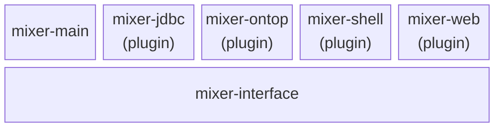

# mixer

Parent POM module of obda-mixer.

This module provides centralized Maven configuration about plugins, dependencies and build profiles. A `build.sh` build script relying on Maven and a `Dockerfile` are also provided.

Modules of obda-mixer are organized with module obda-interface defining common abstractions (**Mixer**, **QuerySelector**) and a plugin mechanism. On top of it, module **mixer-main** provides the main class relying on plugins available on the classpath at runtime. Remaining modules implement a basic set of plugins for different backends and are included by default in the generated obda-mixer fat jar.

