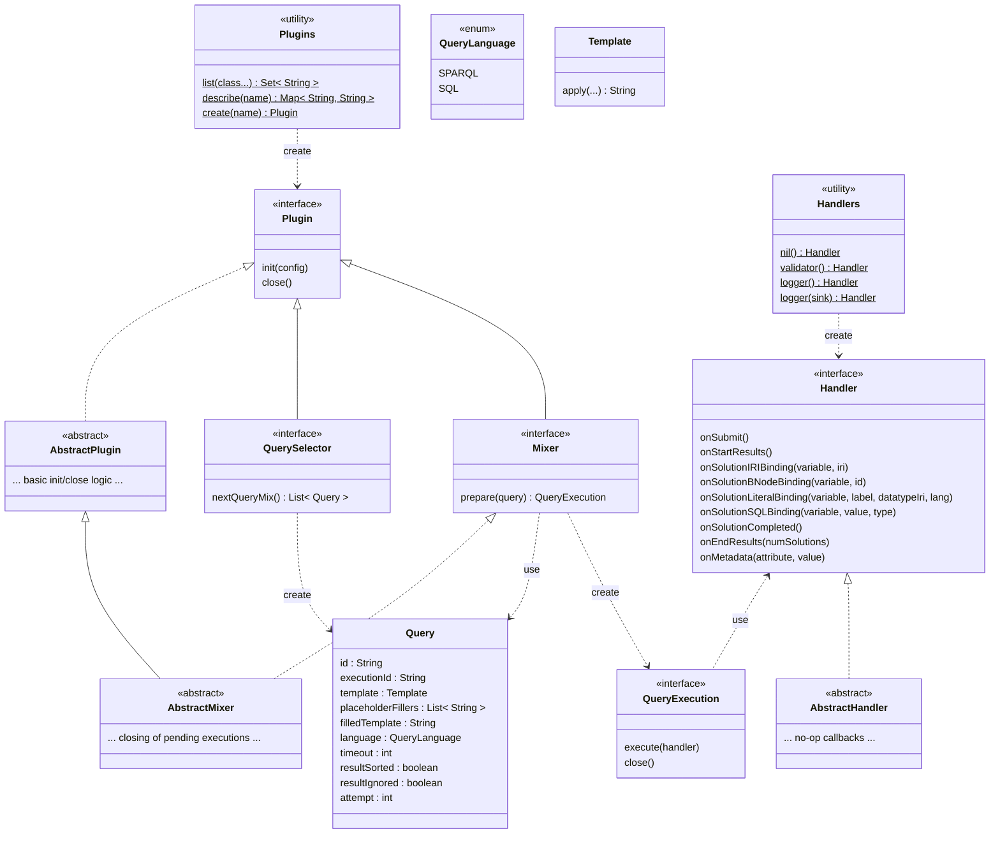

# mixer-interface

Defines interfaces and classes for implementing obda-mixer plugins.

To build a plugin, import this module as compile dependency and implement either the Mixer or the QuerySelector interface. See corresponding Javadoc for further information.   

