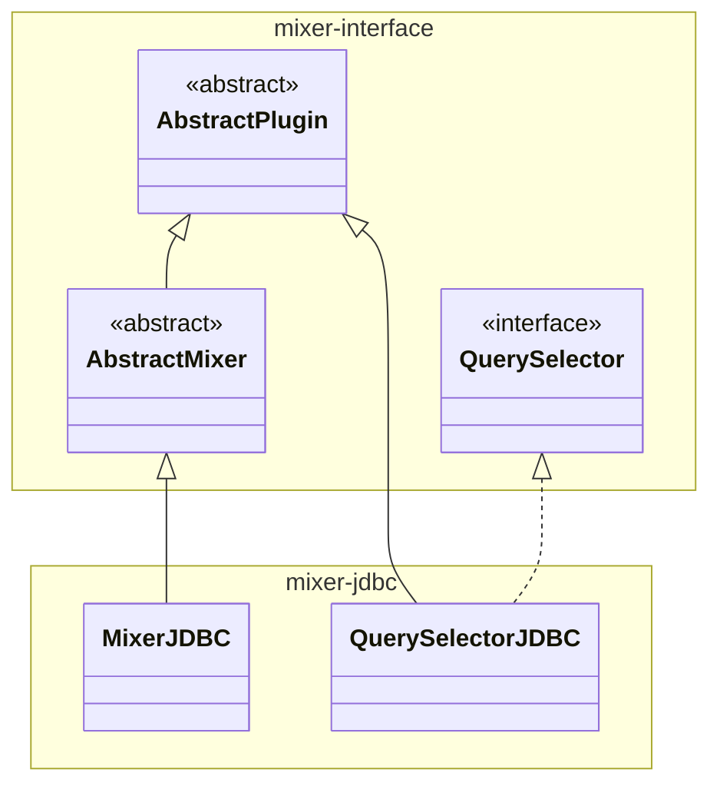

# mixer-jdbc

Implements two obda-mixer plugins relying on a JDBC data source:
* **MixerJDBC** plugin: implementation of Mixer that evaluates SQL queries on a JDBC source;
* **QuerySelectorJDBC** plugin: implementation of QuerySelector that runs user supplied SQL queries over a JDBC source to extract the placeholder fillers required to instantiate the queries of a mix.

This module is included as either provided (for testing) or runtime (for packaging) dependency of mixer-main.

