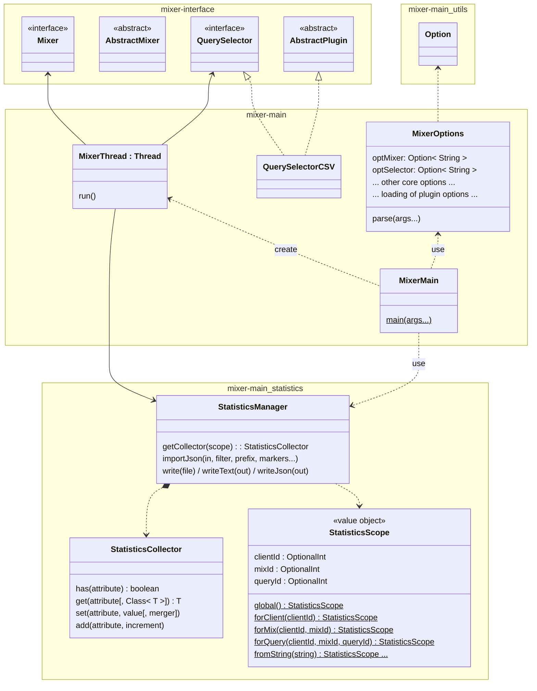

# mixer-main

Provides main class (**MixerMain**) for running obda-mixer.

This module:
* builds on mixer-interface and its plugin mechanism for instantiating query mixes (**QuerySelector**) and for evaluating them (**Mixer**);
* includes a built-in plugin for instantiating mixes from a CSV file (**QuerySelectorCSV**);
* includes logics to manage query evaluation statistics (**StatisticsManager**), supporting their collection (**StatisticsCollector**) at different global/client/mix/query scopes (**StatisticsScope**), as well the possibility of including data from external log files (e.g., Ontop one);
* includes a simple built-in mechanism to parse the command line (**Option**), supporting extra options defined in metadata of plugins available at runtime;
* supports the generation of a "really-executable" fat-jar embedding compiled code and an executable startup shell script (**src/assembly/fatjar-embedded-run-script.sh**).

Plugins coming with obda-mixer are included as provided dependencies to facilitate testing. These are promoted runtime dependencies when generating the obda-mixer fat jar.

