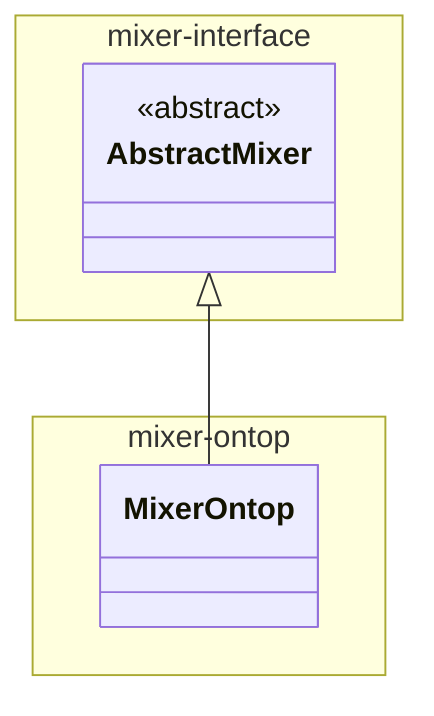

# mixer-ontop

Implements the **MixerOntop** plugin providing an implementation of Mixer over Ontop v4 running embedded in the same JVM. 

This module is included as either provided (for testing) or runtime (for packaging) dependency of mixer-main.

