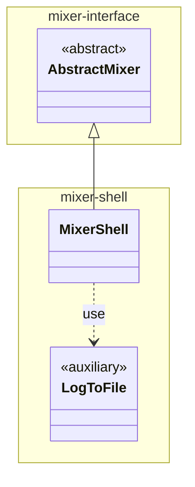

# mixer-shell

Implements the **MixerShell** plugin providing an implementation of Mixer that evaluates query by running a configurable shell command. 

This module is included as either provided (for testing) or runtime (for packaging) dependency of mixer-main.

