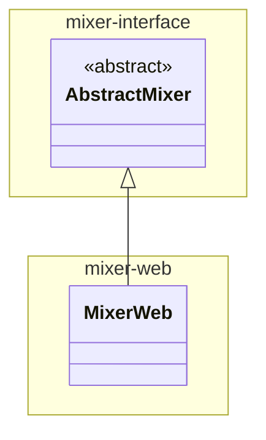

# mixer-web

Implements the **MixerWeb** plugin, which provides an implementation of Mixer that evaluates SPARQL queries over a SPARQL endpoint. 

This module is included as either provided (for testing) or runtime (for packaging) dependency of mixer-main.

